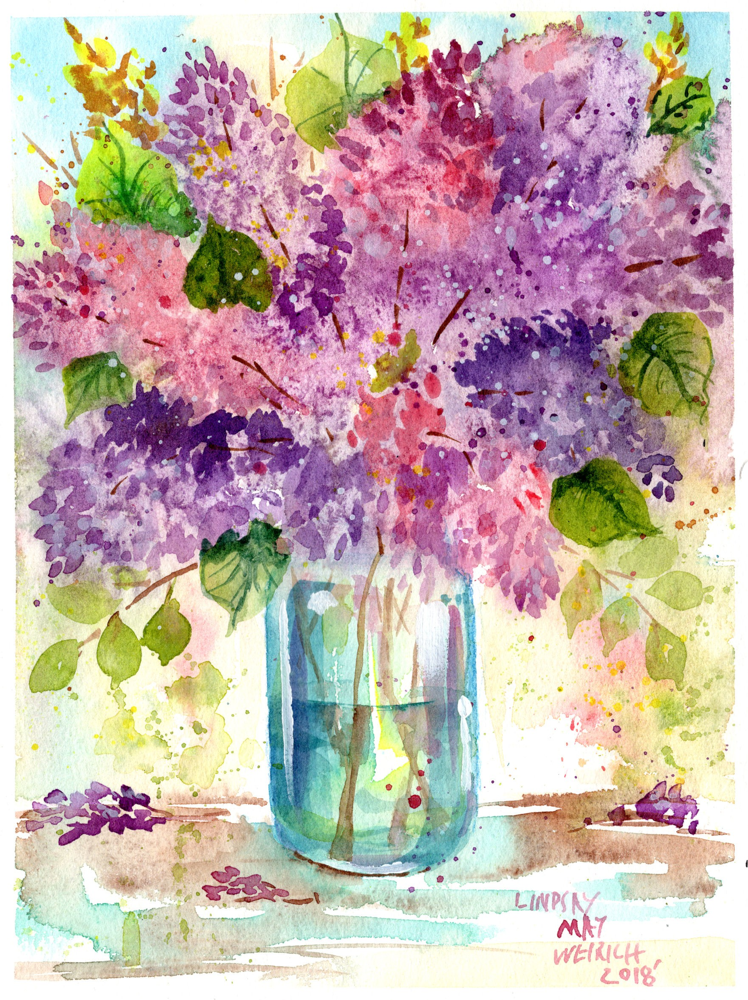
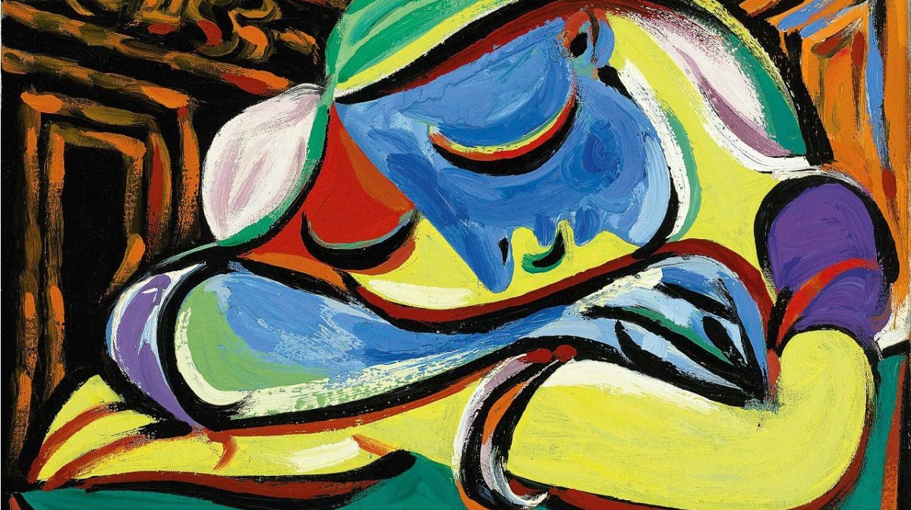
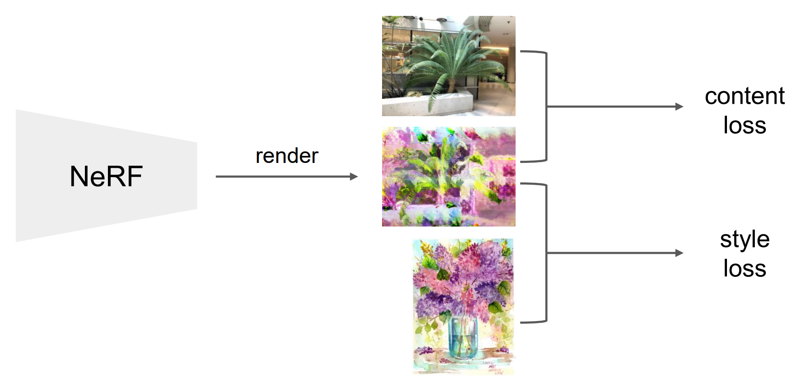

# Stylized-NeRF

This project aims to perform neural style transfer ([A Neural Algorithm of Artistic Style](https://arxiv.org/abs/1508.06576)) 
on a [NeRF](https://www.matthewtancik.com/nerf) generated scene.


<p align="center">
    
</p>

<p align="center">

</p>

## Data Preparation
Please follow the instructions [here](https://github.com/yenchenlin/nerf-pytorch#more-datasets) to prepare the necessary data
for NeRF training.

## How to Run
- Please make sure to run
  ```bash
  bash download_model.sh
  ```
  beforehand to download the pre-trained VGG-19 weights for the later style-transfer algorithm.

- The style transfer here requires the model to be pretrained with the original NeRF algorithm.  
One may consider training such a model using the codes from [nerf-pytorch](https://github.com/yenchenlin/nerf-pytorch), 
or directly download the pre-trained models provided in the same repo.  
The pretrained model weights should be renamed to `pretrain.tar` and be placed under the folder `logs/[exp_name]`, 
where `[exp_name]` is the folder in which the logs of the later stylization experiment will be saved.

Now to run the style-transfer algorithm, please refer to [run_nerf_stylization.py](run_nerf_stylization.py#L439) for all the training options. 
Belows are some example commands for different usages:

_**stylize from a NeRF-pretrained model**_
```python
python run_nerf_stylization.py \
--config configs/fern.txt \
--expname style1 \
--style_path style1.jpg \
--patch_size 80 \
--patch_num 2
--no_resume
```

_**resume stylization**_
```python
python run_nerf_stylization.py \
--config configs/fern.txt \
--expname style1 \
--style_path style1.jpg \
--patch_size 80 \
--patch_num 2
```

Please do note that due to the gpu memory limitation, the stylization in this repo is implemented in a patch-by-patch fashion. 
One may adjust the argument `[--patch_size]` to cope with the OOM (Out Of Memory) problem.  
On the otherhand, `[--patch_num]` decides the number of patches in total an image of the scene will be divided into. 
Setting `patch_num` to `2`, for example, yieds a total of 2 x 2 = 4 patches for an image during the stylization.

_**render stylized results**_
```python
python run_nerf_stylization.py \
--config configs/fern.txt \
--expname style1 \
--render_only
```

## Acknowledgements
This code repo is heavily based on [nerf-pytorch](https://github.com/yenchenlin/nerf-pytorch). 
Thanks the author for his great job!
